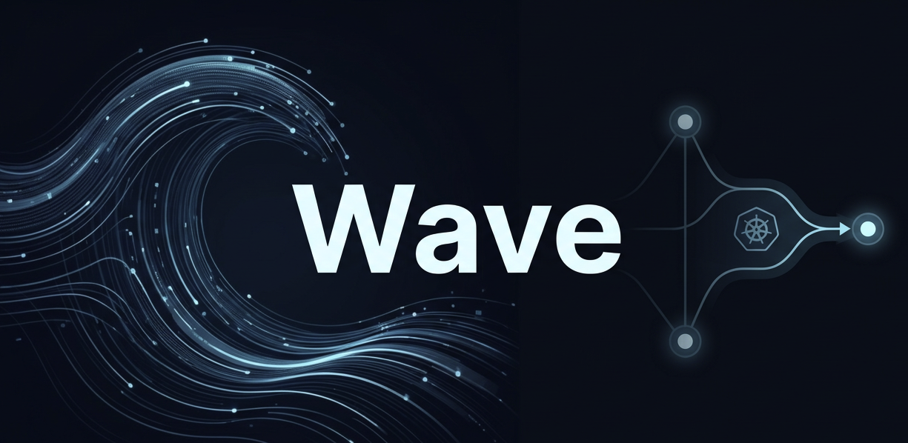

# Wave

Wave is a gateway in front of vLLM that adds routing, caching, tenant controls, and metrics for LLM apps.

See [LLM-Inference-Gateway-TODO.md](./LLM-Inference-Gateway-TODO.md) for the full roadmap.

**Kubernetes / Docker worker:** `Dockerfile.worker` uses the official [**vLLM CPU OpenAI image**](https://docs.vllm.ai/en/stable/getting_started/installation/cpu.html#pre-built-images) (`vllm/vllm-openai-cpu`, `latest-arm64` or `latest-x86_64`). For a fast routing-only smoke test on kind, use `WAVE_WORKER=mock` with [k8s/README.md](./k8s/README.md).

---

## What Wave adds on top of vLLM

- **OpenAI-compatible gateway**: `POST /v1/chat/completions` with a stable API surface for clients.
- **Multi-tenancy hooks**: tenant model allow-lists and context limits via `tenant_id`.
- **Metrics**: Prometheus request QPS/latency/error counters (gateway-level).
- **Routing + affinity**:
  - Redis-backed session stickiness (`conversation_id -> worker_id`).
  - KV-pressure-aware worker selection for new conversations.
  - **Eviction + reroute** under KV pressure: unpin conversations from saturated workers (cold-start reroute to a healthier worker).
- **Priority scheduling** (gateway-level): for non-streaming calls, a small request-queue that prioritizes premium over free before dispatching to the worker.
- **Prompt caching** (conversation-scoped):
  - Exact cache: normalized prompt within `(conversation_id, model)`.
  - Optional semantic cache via embeddings (if `sentence-transformers` is installed).

